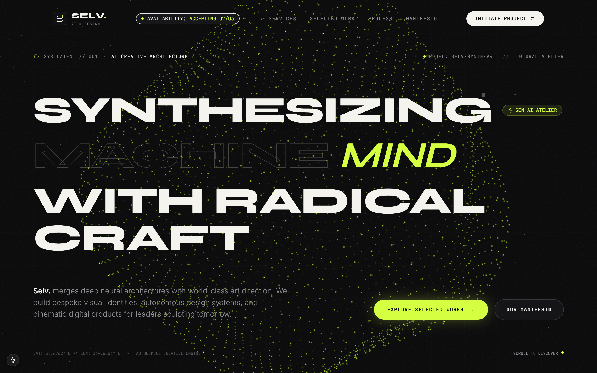
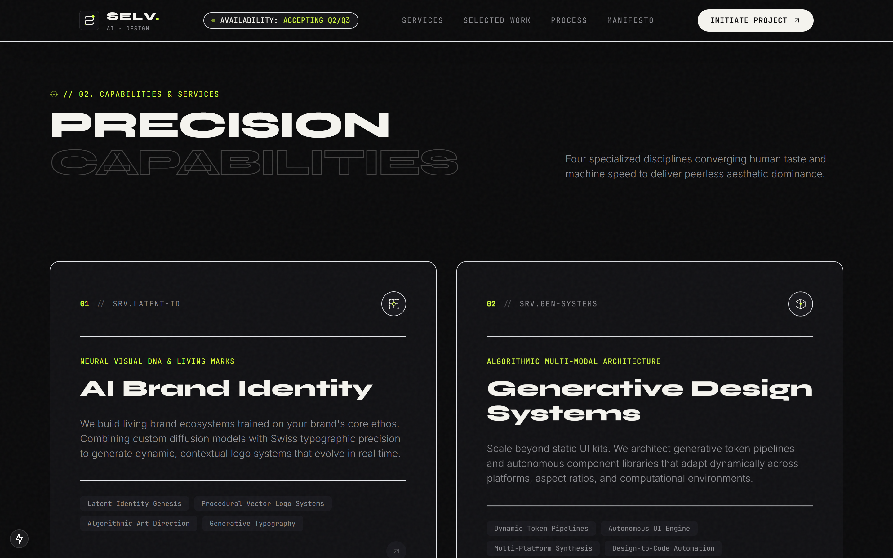
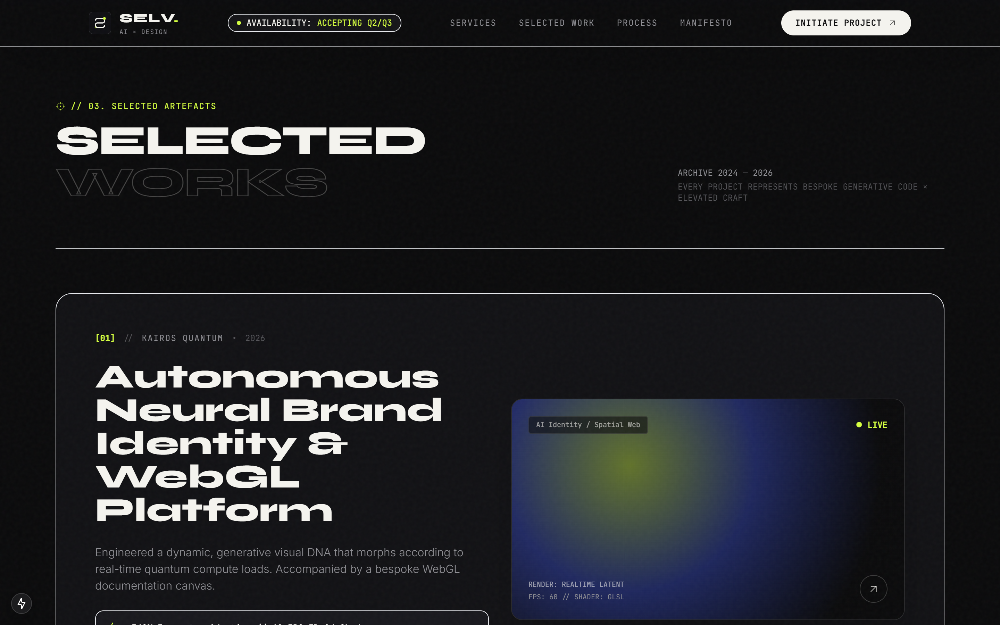
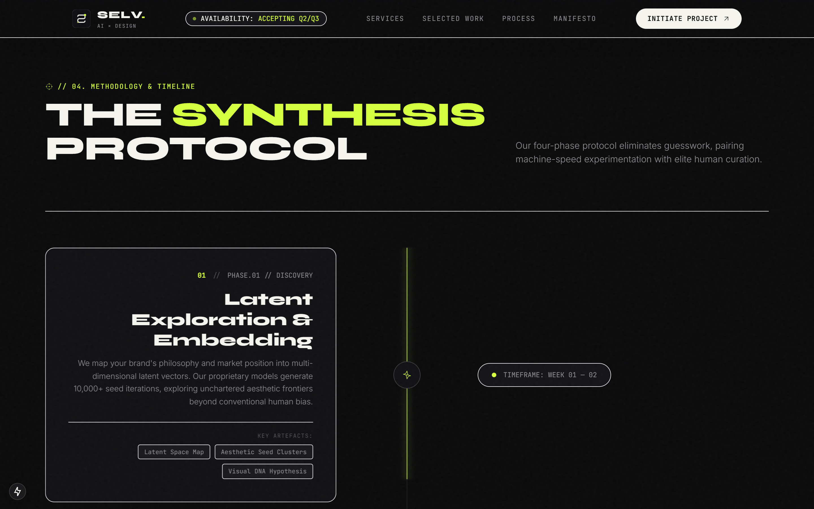
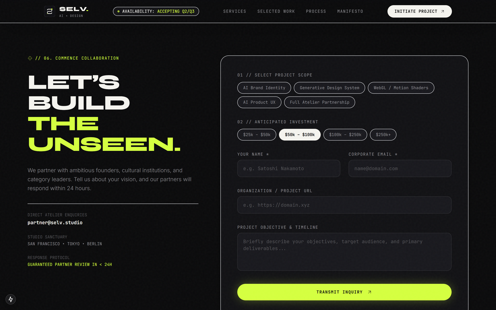

# Selv. — AI Creative Studio & Synthetic Aesthetics

> **"Intelligence as raw material. Form as pure desire."**  
> Landing page interaktif berstandar *quiet luxury tech* kelas dunia untuk studio kreatif kecerdasan buatan fiktif bernama **Selv.** Menggabungkan frontier machine learning, 3D WebGL real-time compute particles, tipografi editorial Swiss, micro-interactions berbasis fisika, serta sintesis audio prosedural.

<p align="center">
  
</p>

---

## 📑 Daftar Isi
- [1. Ringkasan Proyek & Galeri Visual](#1-ringkasan-proyek--galeri-visual)
- [2. AI Engine, Tools & Skills (Spesifikasi Eksekusi)](#2-ai-engine-tools--skills-spesifikasi-eksekusi)
- [3. Filosofi & Konsep Visual](#3-filosofi--konsep-visual)
- [4. Fitur Utama & Interaktivitas](#4-fitur-utama--interaktivitas)
- [5. Tech Stack & Dependensi](#5-tech-stack--dependensi)
- [6. Master Prompt & Panduan Reproduksi](#6-master-prompt--panduan-reproduksi)
- [7. Design Tokens & Arsitektur CSS](#7-design-tokens--arsitektur-css)
- [8. Struktur Direktori](#8-struktur-direktori)
- [9. Panduan Menjalankan Lokal (Quickstart)](#9-panduan-menjalankan-lokal-quickstart)
- [10. Optimasi Performa & Aksesibilitas](#10-optimasi-performa--aksesibilitas)

---

## 1. Ringkasan Proyek & Galeri Visual

**Selv.** adalah sebuah landing page satu halaman penuh (*single-page experience*) yang dirancang untuk merepresentasikan studio kreatif AI premium global. Halaman ini mendemonstrasikan bagaimana teknologi frontier AI dan seni desain tingkat tinggi dapat berpadu tanpa kesan *cliché* atau *cyberpunk murahan*, melainkan hadir dengan estetika *quiet luxury*, elegan, presisi matematis, dan interaktif.

### 🖼️ Preview Antarmuka:

| 01. Capabilities & Services | 02. Selected Artefacts & Works |
| :---: | :---: |
|  |  |

| 03. Synthesis Protocol (Timeline) | 04. Commission & Studio Footer |
| :---: | :---: |
|  |  |

### Karakteristik Desain:
- **Tone**: Dark, sensual, precise, futuristic-minimalist (*Quiet Luxury Tech*).
- **Tipografi**: Kontras skala ekstrem antara display monumental (`Syne` / `Space Grotesk`) dengan metadata teknis monospaced (`JetBrains Mono`).
- **3D Interactive Stage**: Sistem partikel WebGL matematis (Fibonacci sphere) dengan respons fisika pergerakan kursor.
- **Micro-Interactions**: Custom trailing magnetic fluid cursor, staggered hover reveals, dan smooth scrolling Lenis + GSAP.

---

## 2. AI Engine, Tools & Skills (Spesifikasi Eksekusi)

Website ini dirancang dan dibangun secara otomatis dengan kolaborasi arsitektur AI tingkat lanjut menggunakan konfigurasi berikut:

### 🤖 AI Agent Platform & Tooling
- **AI Agent Engine**: [Google Antigravity](https://github.com/google) (Antigravity IDE & Autonomous Agent Architecture)
- **Base LLM Model**: **Gemini 3.7 Flash (Medium)**
  - Menggabungkan penalaran logis tingkat lanjut, pemahaman arsitektur frontend modern, dan kecepatan inferensi tinggi untuk mengeksekusi puluhan komponen modular tanpa kompromi performa.

### 🎨 Design Skill: `taste-skill`
Website ini dibangun dengan menerapkan standar visual anti-template & anti-slop dari skill **[taste-skill](https://github.com/Leonxlnx/taste-skill)** oleh Leonxlnx.

#### Cara Menginstal Skill `taste-skill`:
Untuk menambahkan skill `taste-skill` ke dalam workflow AI Agent Anda (Antigravity, Claude Code, Cursor, Copilot, dll.), jalankan perintah berikut di terminal:
```bash
npx skills add Leonxlnx/taste-skill
```
Atau instal langsung melalui URL repositori:
```bash
npx skills add https://github.com/Leonxlnx/taste-skill
```

#### Pengaruh Skill `taste-skill` pada Proyek Ini:
1. **Anti-Slop & Anti-Template**: Mencegah layout klise AI (seperti card-in-card bertingkat yang membosankan dan warna gradien neon generik) dengan menerapkan arah desain *quiet luxury tech*.
2. **Intentional Typographic Contrast**: Mengharmonisasikan font display berkarakter kuat (`Syne` / `Space Grotesk`) dengan sans-serif netral (`Inter` / `Geist`) dan monospace teknis (`JetBrains Mono`).
3. **Bespoke Handcrafted SVGs**: Mewajibkan pembuatan 100% custom inline SVG dengan garis hairline tipis geometris (konsisten tanpa icon pack generik).
4. **Asymmetric & Spatial Rhythm**: Tata letak grid asimetris dengan staggered offset pada section services dan showcase karya untuk ritme visual dinamis.
5. **Fluid Motion & Micro-Interactions**: Implementasi custom magnetic fluid cursor, physics-based vertex deformation pada 3D particle canvas, serta parallax timeline yang halus.

---

## 3. Filosofi & Konsep Visual

1. **Palet Warna Terkalibrasi**:
   - **Obsidian Background**: `#08080A` & `#0A0A0D` — kedalaman ruang tanpa saturasi berlebih.
   - **Card & Surface**: `rgba(14, 14, 18, 0.7)` dengan efek *glassmorphism backdrop blur*.
   - **Warm Off-White Typography**: `#F5F4EF` — kontras lembut yang nyaman bagi mata.
   - **Electric Lime Signature Accent**: `#D4FF3F` — aksen tajam berenergi tinggi untuk *highlight*, titik fokus interaktif, dan status *beacon*.
   - **Secondary Luminescence**: `#3D5AFE` (Cobalt) & `#38E1FF` (Cyan) pada pencahayaan partikel 3D.

2. **Zero Generic Assets**:
   - **100% Custom Inline SVGs**: Tidak menggunakan library icon umum (*Lucide, Heroicons, FontAwesome*). Semua icon digambar sendiri dengan garis tipis geometris (*hairline monoline stroke-width 1.25px - 1.5px*).
   - **Generative Procedural Artworks**: Semua thumbnail showcase proyek menggunakan gradien prosedural abstrak bertingkat yang dihasilkan melalui CSS / Canvas (bukan foto stok umum).
   - **Film-Grain Texture**: Overlay noise SVG dinamis untuk memberikan kesan sinematik/filmik.

---

## 4. Fitur Utama & Interaktivitas

| Fitur | Deskripsi |
|---|---|
| **Editorial Preloader** | Animasi loading bertahap `00 -> 100%` dengan log status kompilasi kernel AI dan transisi reveal tirai split ke atas. |
| **Generative 3D Hero Canvas** | Partikel 3D berbasis distribusi bola Fibonacci dengan deformasi noise Simplex. Mendukung 3 mode interaktif: **Sphere**, **Wave**, dan **Vortex**. |
| **Custom Magnetic Cursor** | Mengikuti pointer dengan pegas (*spring physics*), membesar saat hover link/button, dan bertransformasi menjadi badge status `"EXPLORE"` saat berada di atas kartu proyek. |
| **Procedural Web Audio Engine** | Sintesis suara mikro (*micro-clicks* frekuensi tinggi saat hover, *tactile thump* saat klik, dan akord C-Major saat submit form) dengan tombol mute/unmute. |
| **Infinite Partner Marquee** | Ticker berjalan mulus berisi nama-nama studio dan partner riset komputasi dengan jeda interaktif saat di-hover. |
| **Staggered Services Layout** | Layout *non-grid* asimetris dengan 4 pilar layanan AI (*Brand Identity, Generative Design Systems, Motion/WebGL, AI Product UX*). |
| **Selected Work Archive** | Showcase 4 proyek fiktif (*Aether OS, Kronos Synthesis, Cybernetic Botanica, Monolith Luxury*) dilengkapi modal *case inspection drawer*. |
| **Methodology Timeline** | Visualisasi 4 tahap kerja studio (*Latent Space Ingestion, Parametric Prototyping, Editorial Synthesis, Living Deployment*). |
| **Typographic Manifesto** | Blok kutipan filosofi berukuran monumental dengan efek interaktif *magnetic word hover*. |
| **Bespoke Commission Form** | Form pemilihan ruang lingkup proyek & tier alokasi anggaran dengan feedback konfirmasi receipt token dinamis. |
| **Studio Footer** | Jam dunia langsung (*dual live clocks* San Francisco PST & Zürich CET), indikator ketersediaan real-time, dan tombol elevator *ascend to top*. |

---

## 5. Tech Stack & Dependensi

### Core Framework & Language
- **[Next.js 15 (App Router)](https://nextjs.org/)** — Server Components, code-splitting otomatis, dan optimasi font.
- **[React 19](https://react.dev/)** — Arsitektur komponen reaktif modern.
- **[TypeScript 5](https://www.typescriptlang.org/)** — Strict type safety di seluruh modul.

### Styling & Design System
- **[Tailwind CSS v4](https://tailwindcss.com/)** — Styling utilitas generasi terbaru dengan engine performa tinggi.
- **CSS Custom Properties** — Sistem token warna, radius, dan shadow yang modular.

### Motion, 3D & Animation
- **[Three.js](https://threejs.org/)** — Engine rendering WebGL untuk partikel generatif dan matematika 3D.
- **[Framer Motion](https://motion.dev/)** — Animasi komponen, gesture springs, dan transisi halaman.
- **[GSAP + ScrollTrigger](https://gsap.com/)** — Koreografi animasi scroll kompleks dan sinkronisasi render loop.
- **[Lenis](https://lenis.darkroom.engineering/)** — Smooth scrolling momentum berbasis inersia.

### Audio & Fonts
- **Web Audio API Native** — Sintesis suara prosedural tanpa aset audio eksternal (`.mp3`/`.wav`).
- **`next/font/google`** — Tipografi zero-layout-shift (`Plus Jakarta Sans`, `Syne`, dan `JetBrains Mono`).

---

## 6. Master Prompt & Panduan Reproduksi

Gunakan prompt master di bawah ini saat meminta AI Agent (di dalam **Google Antigravity** dengan model **Gemini 3.7 Flash** dan skill **`taste-skill`**) untuk membangun ulang proyek ini:

```markdown
Kamu adalah Senior Frontend Architect & Visual Designer dengan standar TASTE SKILL (Leonxlnx/taste-skill), kelas dunia, dengan sensibilitas seni tajam — setara desainer di studio seperti Pentagram, Bruno Simon, atau Rauno Freiberg. Bangun SATU landing page lengkap untuk sebuah AI Creative Studio fiktif bernama "Selv." (studio yang menggabungkan AI dan desain untuk brand-brand premium). Setiap detail — dari kode hingga visual — harus dieksekusi dengan presisi tinggi, anti-slop, tanpa elemen generik.

## ENVIRONMENT & TOOLING
- Tooling: Google Antigravity
- Model: Gemini 3.7 Flash (Medium)
- Skills: taste-skill (npx skills add Leonxlnx/taste-skill)

## TECH STACK
- Next.js 15 (App Router) + TypeScript
- Tailwind CSS v4 + CSS custom properties untuk design tokens
- Framer Motion (motion/react) untuk micro-interactions & page transitions
- GSAP + ScrollTrigger untuk animasi scroll kompleks
- Three.js WebGL / React Three Fiber untuk elemen 3D hero (abstract particle/blob generatif beresponsif terhadap mouse pointer)
- Lenis untuk smooth scroll
- next/font untuk tipografi custom
- Icon: SEMUA icon dibuat custom sebagai inline SVG buatan sendiri, dirancang sesuai bahasa visual brand (garis tipis, geometris, konsisten stroke-width). JANGAN gunakan Lucide, Heroicons, Font Awesome, atau icon library generik apapun.

## KONSEP VISUAL
- Mood: dark, elegan, futuristik-minimalis — "quiet luxury tech"
- Palet warna: latar hampir hitam (#08080A / #0E0E12), teks off-white (#F5F4EF), aksen signature electric lime (#D4FF3F)
- Tipografi: display font geometris/kuat (Syne / Space Grotesk / Plus Jakarta Sans) untuk headline besar, font monospaced (JetBrains Mono) untuk label teknis
- Layout: grid asimetris, headline monumental dengan variasi ukuran huruf ekstrem, banyak intentional whitespace
- Custom cursor yang berubah bentuk saat hover elemen interaktif (termasuk badge "EXPLORE" pada project cards)
- Noise/grain texture halus di background untuk kesan filmic
- Custom text selection styling

## STRUKTUR HALAMAN
1. Hero — headline monumental ("INTELLIGENCE AS RAW MATERIAL. FORM AS PURE DESIRE."), elemen 3D partikel interaktif (12.000+ particles pada Fibonacci sphere), mode switcher (Sphere/Wave/Vortex), subtitle, dual CTA
2. Marquee/ticker — infinite ticker horizontal berisi nama partner AI & lab riset
3. Services — 4 pilar layanan (AI Brand Identity, Generative Design Systems, Motion & Spatial Web, AI-Assisted Product Design) dengan layout staggered/offset non-grid dan custom SVG icons
4. Selected Work — 4 proyek fiktif (Aether OS, Kronos Synthesis, Cybernetic Botanica, Monolith Luxury) dengan visual gradien prosedural abstrak, metrik terverifikasi, dan modal case inspection drawer
5. Process — timeline 4 fase interaktif (Latent Space Ingestion, Parametric Prototyping, Editorial Synthesis, Living Deployment)
6. Manifesto — kutipan filosofi besar dengan efek interactive magnetic word hover
7. Contact / Briefing — form custom untuk pemilihan lingkup disiplin, tier anggaran, dan status konfirmasi receipt token
8. Footer — jam dunia langsung (San Francisco PST & Zürich CET), indikator ketersediaan, custom SVG social icons, dan elevator back-to-top button
```

---

## 7. Design Tokens & Arsitektur CSS

Definisi token dalam `src/app/globals.css`:

```css
:root {
  --bg-primary: #08080a;
  --bg-secondary: #0e0e12;
  --bg-tertiary: #16161c;
  --surface-card: rgba(18, 18, 23, 0.7);
  --surface-glass: rgba(255, 255, 255, 0.03);
  --border-subtle: rgba(255, 255, 255, 0.08);
  --border-highlight: rgba(255, 255, 255, 0.18);
  --text-primary: #f5f4ef;
  --text-secondary: #8e8d97;
  --text-muted: #52515a;
  --accent-lime: #d4ff3f;
  --accent-lime-dim: rgba(212, 255, 63, 0.15);
  --accent-glow: 0 0 35px rgba(212, 255, 63, 0.35);
}
```

---

## 8. Struktur Direktori

```text
Selv/
├── public/
│   └── demo/
│       ├── hero-preview.png       # Preview Hero & 3D WebGL Particle Canvas
│       ├── services-preview.png   # Preview Staggered Services Layout
│       ├── work-preview.png       # Preview Selected Works Showcase
│       ├── process-preview.png    # Preview Synthesis Protocol Timeline
│       ├── contact-preview.png    # Preview Commission Form & Footer
│       └── selv-fullpage-preview.png # Fullpage High-Resolution Capture
├── resource/
│   └── notes/
│       └── design-system.md       # Dokumentasi design tokens & guidelines
├── src/
│   ├── app/
│   │   ├── globals.css            # Design tokens, noise filter, custom scrollbar
│   │   ├── layout.tsx             # Root layout, Google Fonts, SEO metadata
│   │   └── page.tsx               # Master single-page assembly
│   ├── components/
│   │   ├── canvas/
│   │   │   └── Hero3DCanvas.tsx   # 3D WebGL Particle System & Shader Engine
│   │   ├── sections/
│   │   │   ├── HeroSection.tsx
│   │   │   ├── MarqueeSection.tsx
│   │   │   ├── ServicesSection.tsx
│   │   │   ├── SelectedWorkSection.tsx
│   │   │   ├── ProcessSection.tsx
│   │   │   ├── ManifestoSection.tsx
│   │   │   ├── ContactSection.tsx
│   │   │   └── FooterSection.tsx
│   │   └── ui/
│   │       ├── CustomCursor.tsx   # Magnetic spring cursor & mode badges
│   │       ├── Icons.tsx          # 100% bespoke inline geometric SVG icons
│   │       ├── MagneticButton.tsx # Spring physics magnetic wrapper
│   │       ├── Navbar.tsx         # Glassmorphic header & sound toggle
│   │       ├── Preloader.tsx      # High-concept 0-100% percentage loader
│   │       ├── SmoothScroll.tsx   # Lenis + GSAP ScrollTrigger sync
│   │       └── SoundEffects.tsx   # Web Audio API procedural synthesizer
├── next.config.ts
├── package.json
├── postcss.config.mjs
├── tsconfig.json
├── WORKSPACE.md
└── README.md
```

---

## 9. Panduan Menjalankan Lokal (Quickstart)

### Prasyarat
- **Node.js**: `v18.18.0` atau yang lebih baru (disarankan Node v20+)
- **NPM** / **PNPM** / **Bun**

### Langkah Instalasi
1. Clone atau masuk ke direktori proyek:
   ```bash
   cd Selv
   ```

2. Instal dependensi:
   ```bash
   npm install --legacy-peer-deps
   ```

3. Jalankan server pengembangan:
   ```bash
   npm run dev
   ```

4. Buka di browser:
   ```text
   http://localhost:{xxxx}
   ```

### Membangun untuk Produksi
```bash
npm run build
npm run start
```

---

## 10. Optimasi Performa & Aksesibilitas

- **GPU-Accelerated Animations**: Transformasi hanya memanfaatkan properti `transform` dan `opacity` untuk menjamin 60-120 FPS tanpa layout thrashing.
- **Lazy WebGL Initialization**: Canvas 3D mengelola lifecycle memori secara ketat dengan pembersihan geometri & material saat unmount untuk mencegah memory leak.
- **Accessibility & Reduced Motion**: Menghormati pengaturan OS `prefers-reduced-motion: reduce` dengan mematikan partikel berat dan transisi berlebihan.
- **Semantic HTML & WCAG Compliance**: Penggunaan struktur heading bertingkat, kontras teks minimum 4.5:1, dan keyboard focusability.

---

<p align="center">
  <b>© 2026 TAKICOBACOBA</b><br />
  <i>Built with Google Antigravity • Powered by Gemini 3.7 Flash • Guided by Leonxlnx/taste-skill</i>
</p>
